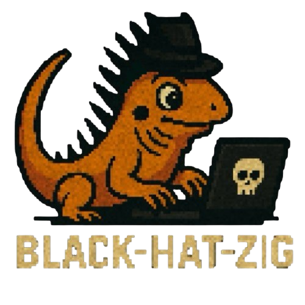

# Black-Hat-Zig

<p align="center">
  
  
  
  
</p>

<!-- <p align="center"> -->
<!--   <a href="#intro">Intro</a> • -->
<!--   <a href="#why-zig-">Why Zig?</a> • -->
<!--   <a href="#compiling-the-codes">Compiling the codes</a> • -->
<!--   <a href="#payload-placement">Payload Placement</a> • -->
<!--   <a href="#payload-obfuscation">Payload Obfuscation</a> • -->
<!--   <a href="#payload-encryption">Payload Encryption</a> • -->
<!--   <a href="#payload-execution">Payload Execution</a> • -->
<!--   <a href="#reverse-shell">Reverse Shell</a> • -->
<!--   <a href="#malware-techniques">Malware Techniques</a> • -->
<!--   <a href="#contribution">Contribution</a> • -->
<!--   <a href="#credits--references">Credits & References</a> • -->
<!--   <a href="#disclaimer">Disclaimer</a> -->
<!-- </p> -->

<p height="350px" align="center">
  
<br/>
  <b>Hello hackers. Hello maldevs. Hello reversers. Nice to see you here to explore the dark power of Zig!</b>
</p>

---

## ToC

- [Intro](#intro)
- [Why Zig?](#why-zig)
- [Compiling the codes](#compiling-the-codes)
- [Payload Placement](#payload-placement)
- [Payload Obfuscation](#payload-obfuscation)
- [Payload Encryption](#payload-encryption)
- [Payload Execution](#payload-execution)
- [Reverse Shell](#reverse-shell)
- [Malware Techniques](#malware-techniques)
- [Maldev Tools](#maldev-tools)
- [Contribution](#contribution)
- [Credits & References](#credits--references)
- [Disclaimer](#disclaimer)

## Intro

> [!IMPORTANT]
> This project is continuously updating!

This project provides many malware techniques implementation using Zig since I'm a huge fan of it. You can use this repo to weaponize Zig. Black-Hat-Zig is continuously updating to make sure it contains as more content as it could. It will be perfect if you want to create a PR for this project.

Okay, let's hack the planet!

## Why Zig?

- 🤝 Easy to interact with C/C++ source
- 🔎 It's newer, so it's harder to be detect
- 💪 Strongly low level control, even lower than C
- 😱 It's harder to RE because of the modern compiler

## Compiling the codes

You can check the codes inside each directory. Also, if the code uses Windows API, you will see the hint in the corresponding project directory `README.md`, for example, [this one](./Payload-Encryption/AES/bcrypt_aes/).

I've already set the corresponding default building target to `windows-x86_64` for those needed a Windows API, so you can easily copy & paste the following command to compile the code wherever you are on Linux, Windows, even MacOS! (But you still need a Windows environment to run the executables)

```bash
zig build
```

## Payload Placement

Techniques to place malicious payloads in various sections of an executable file.

- [.data Section](./Payload-Placement/dot_data_section/)
- [.rdata Section](./Payload-Placement/dot_rdata_section/)
- [.text Section](./Payload-Placement/dot_text_section/)
- [.rsrc Section](./Payload-Placement/dot_rsrc_section/)

## Payload Obfuscation

Obfuscation techniques to disguise payloads and avoid detection through static analysis or pattern matching.

- [IP Address Obfuscation](./Payload-Obfuscation/IP-Address-Obfuscation/)
  - [IPv4 Obfuscation](./Payload-Obfuscation/IP-Address-Obfuscation/ipv4_obfuscation/)
  - [IPv4 Deobfuscation](./Payload-Obfuscation/IP-Address-Obfuscation/ipv4_deobfuscation/)
  - [IPv6 Obfuscation](./Payload-Obfuscation/IP-Address-Obfuscation/ipv6_obfuscation/)
  - [IPv6 Deobfuscation](./Payload-Obfuscation/IP-Address-Obfuscation/ipv6_deobfuscation/)
- [MAC Address Obfuscation](./Payload-Obfuscation/MAC-Address-Obfuscation/)
  - [MAC Address Obfuscation](./Payload-Obfuscation/MAC-Address-Obfuscation/MACFuscation/)
  - [MAC Address Deobfuscation](./Payload-Obfuscation/MAC-Address-Obfuscation/MACDeobfuscation/)
- [UUID Obfuscation](./Payload-Obfuscation/UUID-Obfuscation/)
  - [UUID Obfuscation](./Payload-Obfuscation/UUID-Obfuscation/UUIDFuscation/)
  - [UUID Deobfuscation](./Payload-Obfuscation/UUID-Obfuscation/UUIDDeobfuscation/)

## Payload Encryption

Various encryption schemes used to hide the real intent of a payload during storage or transmission.

- [XOR Encryption](./Payload-Encryption/XOR/)
  - [XOR With Standard Library](./Payload-Encryption/XOR/std_lib_xor/)
- [RC4 Encryption](./Payload-Encryption/RC4/)
  - [RC4 With SystemFunction032](./Payload-Encryption/RC4/system_function_032_rc4/)
- [AES Encryption](./Payload-Encryption/AES/)
  - [AES With Bcrypt.h](./Payload-Encryption/AES/bcrypt_aes/)
  - [AES With Standard Library](./Payload-Encryption/AES/std_aes/)
  - [AES With TinyAES](./Payload-Encryption/AES/tiny_aes/)

## Payload Execution

- [DLL](./Payload-Execution/dll/)
- [Shellcode](./Payload-Execution/shellcode/)

## Reverse Shell

Primitives for establishing reverse shells for C2 access or post-exploitation control.

- [Reverse Shell With Standard Library](./Reverse-Shell/std_reverse_shell/)

## Malware Techniques

A collection of common offensive tradecraft techniques adapted to Zig.

- [Process Injection](./Malware-Techniques/Process-Injection/)
  - [DLL Injection](./Malware-Techniques/Process-Injection/dll_injection/)
  - [Shellcode Injection](./Malware-Techniques/Process-Injection/shellcode_injection/)
- [Payload Staging](./Malware-Techniques/Payload-Staging/)
  - [From Web Server](./Malware-Techniques/Payload-Staging/web_server/)
  - [From Windows Registry](./Malware-Techniques/Payload-Staging/windows_registry/)

## Maldev Tools

- [ZYRA: Your Runtime Armor](https://github.com/cx330blake/zyra)
  - An executable packer written in Zig
- [ZYPE: Your Payload Encryptor](https://github.com/cx330blake/zype)
  - Generate a code template in Zig containing your encrypted/obfuscated payload and the corresponding decrypting/deobfuscating function.

## Contribution

This project is currently maintained by [@CX330Blake](https://github.com/CX330Blake). PRs are welcomed. Hope there's more people use Zig for malware developing so the ecosystem will be more mature.

## Credits & References

- [Maldev Academy](https://maldevacademy.com/)
- [OffensiveNim](https://github.com/byt3bl33d3r/OffensiveNim)

## Disclaimer

This project is for ethical and educational purpose only. Don't be a cyber criminal.
